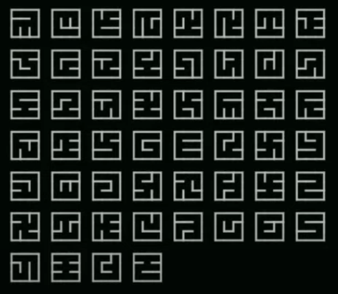

# Maze Canvas

This repo has two concerns:

1. Generative an exhaustive list of mazes of a given size.
2. Drawing these mazes in an attractive style using HTML Canvas API.

[](https://github.com/mckoss/maze-canvas/actions/workflows/main.yml)


# Generating Mazes

It has been trickier than it first seemd to generate mazes of a given size (and count them accurately).  While random maze generation
is relatively straightforward, enumerating all valid mazes
exhaustively is more complicated.

At present, this code has not been optimized to be as fast as
possible, but it does use some prgressive generation methods
designed to be more easily optimized.

The algorithm can be summarized as:

1. Begin with the top row of the maze.
2. Generate all possible combinations of vertical walls.
3. Generate all possible combinations of horizontal (floor) walls
   (separating the first and second row).
4. Repeat for all the rows of the maze.
5. Test if the maze is "perfect" (there is a unique path from every cell to
    every other cell).

# Maze Facts

The On-Line Encyclopedia of Integer sequences lists the [number of unique
mazes of size NxN (A007341)](https://oeis.org/A007341)  as:

| N | Mazes |
|---|---|
| 1 | 1 |
| 2 | 4 |
| 3 | 192 |
| 4	|	100,352 |
| 5	|	557,568,000 |
| 6	|	32,565,539,635,200
| 7	|	19,872,369,301,840,986,112 |
| 8	|	126,231,322,912,498,539,682,594,816 |
| 9	|	8,326,627,661,691,818,545,121,844,900,397,056 |
| 10 |	5,694,319,004,079,097,795,957,215,725,765,328,371,712,000 |
| 11 |	40,325,021,721,404,118,513,276,859,513,497,679,249,183,623,593,590,784 |
| 12 |	2,954,540,993,952,788,006,228,764,987,084,443,226,815,814,190,099,484,786,032,640,000 |

An $m \times n$ maze has $m(n-1) + n(m-1)$ internal wall locations.  Of
those, $m \cdot n - m - n + 1$ walls are used each *perfect* maze (or
$({N - 1})^2$ walls for square mazes).

The cells of a maze for a *spanning tree* when considering each cell a
node in a graph, with the graph edges being the connections between cells
where a wall has been removed.  Since there are $m \cdot\ n$ cells, there
are $m \cdot n - 1$ edges (or removed walls) in the spanning tree.

Carl Mäsak wrote a detailed description of this journey generating the
unique mazes in Perl in 2015:

&nbsp;&nbsp;&nbsp;&nbsp;*[You're in a space of twisty little mazes, all alike](http://strangelyconsistent.org/blog/youre-in-a-space-of-twisty-little-mazes-all-alike)*


He answers the question, *how many unique mazes are there if you don't double
count rotations and reflections*:

| N | Unique Mazes |
|---|---|
| 1 | 1 |
| 2 | 1 |
| 3 | 28 |
| 4 | 12600 |

*The $3 \times 3$ mazes form a nice little "alphabet" of 28 symbols.*

Jared Tarbell gave a nice talk on generative (art) programming where
he also discusses [obsession with mazes](https://youtu.be/b_-9UWkgDf8?t=365).
*Jared claimed there were only 26 unique mazes of size $3 \times 3$ instead of
28? and he showed a picture of 52 *unique* ones that he generated - possibly
not recognizing that some of his mazes are self-reflections.*



# Using this Repo

```
$ npm install
$ npm run build
$ npm test
$ npm run coverage   # For code coverage and performance tracking.
```

I find it convenient to use `tsc --watch` to compile source files
incrementally as they are modified and saved.

The source is written in TypeScript, with the build products
written as ES Module JavaScript files in the `/scripts` directory.

Tests are written in Mocha using (the only sane) TDD-style asserts.

HTML formatted coverage reports will be generated in the `/coverage` directory as well as summarized in text at the end of tests
run with the `npm run coverage` command.

# Future optimizations and features

1. Cut off progressive row generation if:
   - Not all cells can reach an "exit" from the current row.
   - Divergent paths merge into one (allowing multiple pathways between cells).
2. Memoize the counting of the number of mazes that can be generated by
   identical intermediate row configuations (dynamic programming).
3. Cut off maze generation that is not a "canonical" representive.  Most mazes
   have 7 other symetrically related mazes that are identical to them.
4. Produce count of unique mazes up to symmetrical rotations and reflections.
   (also count mazes that have 2, 4, and 8-way symmetry).
5. Command line maze counter.
6. Web page generator with Canvas drawing (and customization).


<script defer>
MathJax = {
  tex: {
    inlineMath: [['$', '$'], ['\\(', '\\)']]
  }
};
</script>
<script id="MathJax-script" defer
  src="https://cdn.jsdelivr.net/npm/mathjax@3/es5/tex-chtml.js">
</script>
