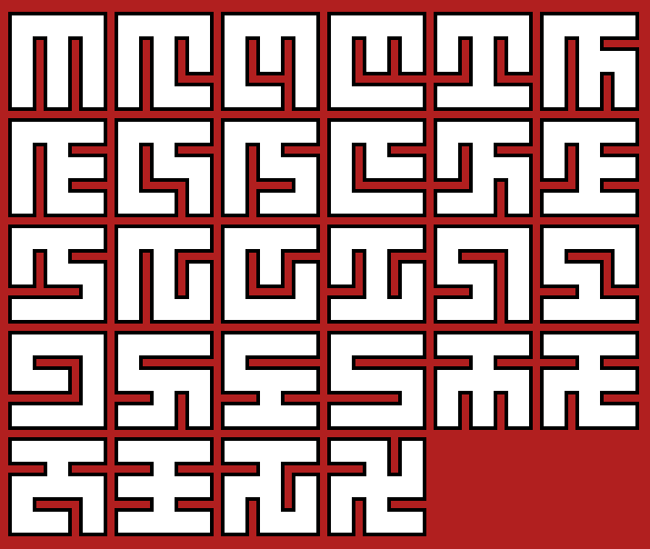

# Maze Canvas

This repo has two concerns:

1. Generative an exhaustive list of mazes of a given size.
2. Drawing these mazes in an attractive style using HTML Canvas API.

To view the formatted equations in this README - visit the hosted version here:

http://mckoss.com/maze-canvas/

[](https://github.com/mckoss/maze-canvas/actions/workflows/main.yml)


# Generating Mazes

It has been trickier than it first seemed to generate mazes of a given size (and
count them accurately).  While random maze generation is relatively
straightforward, enumerating all valid mazes exhaustively is more complicated.

At present, this code has not been optimized to be as fast as possible, but it
does use some prgressive generation methods designed to be more easily
optimized.

The algorithm can be summarized as:

1. Begin with the top row of the maze.
2. Generate all possible combinations of vertical walls.
3. Generate all possible combinations of horizontal (floor) walls
   (separating the first and second row).
4. Repeat for all the rows of the maze.
5. Test if the maze is "valid" (there is a unique path from every cell to
    every other cell).

# Maze Facts

The On-Line Encyclopedia of Integer sequences lists the [number of unique
mazes of size NxN (A007341)](https://oeis.org/A007341)  as:

| N | Mazes |
|---|---|
| 1 | 1 |
| 2 | 4 |
| 3 | 192 |
| 4	|	100,352 |
| 5	|	557,568,000 |
| 6	|	32,565,539,635,200
| 7	|	19,872,369,301,840,986,112 |
| 8	|	126,231,322,912,498,539,682,594,816 |
| 9	|	8,326,627,661,691,818,545,121,844,900,397,056 |
| 10 |	5,694,319,004,079,097,795,957,215,725,765,328,371,712,000 |
| 11 |	40,325,021,721,404,118,513,276,859,513,497,679,249,183,623,593,590,784 |
| 12 |	2,954,540,993,952,788,006,228,764,987,084,443,226,815,814,190,099,484,786,032,640,000 |

An $m \times n$ maze has $m(n-1) + n(m-1)$ internal wall locations.  Of
those, $m \cdot n - m - n + 1$ walls are used in a *valid* maze (or
$({N - 1})^2$ walls for square mazes).

The cells of a maze for a *spanning tree* when considering each cell a
node in a graph, with the graph edges being the connections between cells
where a wall has been removed.  Since there are $m \cdot\ n$ cells, there
are $m \cdot n - 1$ edges (or removed walls) in the spanning tree.

Carl Mäsak wrote a detailed description of this journey generating the
unique mazes in Perl in 2015:

&nbsp;&nbsp;&nbsp;&nbsp;*[You're in a space of twisty little mazes, all alike](http://strangelyconsistent.org/blog/youre-in-a-space-of-twisty-little-mazes-all-alike)*


He answers the question, *how many unique mazes are there if you don't double
count rotations and reflections - up to 4x4 mazes* (extended
to 6x6 mazes by Paul Kim in his [2019 Doctoral Thesis](https://etd.ohiolink.edu/apexprod/rws_etd/send_file/send?accession=osu1563286393237089&disposition=inline)):

| N | Unique Mazes |
|---|---|
| 1 | 1 |
| 2 | 1 |
| 3 | 28 |
| 4 | 12,600 |
| 5 | 69,699,849 |
| 6 | 4,070,693,024,640 |

*The $3 \times 3$ mazes form a nice little "alphabet" of 28 symbols.*



Jared Tarbell gave a nice talk on generative (art) programming where
he also discusses [obsession with mazes](https://youtu.be/b_-9UWkgDf8?t=365).

```
There are 192 mazes of size 3x3.
28 are unique:
---
21 are not symmetric.
5 have 2-way symmetry.
2 have 4-way symmetry.

There are 100,352 mazes of size 4x4.
12,600 are unique:
---
12,488 are not symmetric.
112 have 2-way symmetry.

There are 557,568,000 mazes of size 5x5.
69,699,849 are unique:
---
69,692,175 are not symmetric.
7,626 have 2-way symmetry.
48 have 4-way symmetry.
```

A currently unexplored sequence is the count of *symmetric* mazes on an $n \times n$ grid:

| N | Symmetric Mazes | 2-symmetric | 4-symmetric |
|---|---|---|---|
| 1 | 1 | 1 | 1 |
| 2 | 1 | 1 | - |
| 3 | 7 | 5 | 2 |
| 4 | 112 | 112 | - |
| 5 | 7,674 | 7,626 | 48 |

*Where a symmetry includes any reflection or rotation that maps the maze back to itself.*

# Using this Repo

```
$ npm install
$ npm run build
$ npm test
$ npm run coverage   # For code coverage and performance tracking.
```

I find it convenient to use `npm run watch` to compile source files
incrementally as they are modified and saved.

To count mazes of a given size, use the count-mazes node command line
app:

```
$ scripts/count-mazes.js 4
Calculating...
There are binom(24, 9) = 1,307,504 possible wall placements.
There are 100,352 mazes of size 4x4.
12,600 are unique:
---
12,488 are not symmetric.
112 have 2-way symmetry.
0 have 4-way symmetry.

One in 13.0 of the wall placements are valid mazes.
---
Elapsed time: 2.3s
43,946 mazes per second.
```

I find it convenient to use `npm run watch` to compile source files
incrementally as they are modified and saved.

The source is written in TypeScript, with the build products
written as ES Module JavaScript files in the `/scripts` directory.

Tests are written in Mocha using (the only sane) TDD-style asserts.

HTML formatted coverage reports will be generated in the `/coverage` directory
as well as summarized in text at the end of tests run with the `npm run
coverage` command.

# Future optimizations and features

1. Cut off progressive row generation if:
   - Not all cells can reach an "exit" from the current row.
   - Divergent paths merge into one (allowing multiple pathways between cells).
2. Memoize the counting of the number of mazes that can be generated by
   identical intermediate row configuations (dynamic programming).
3. Cut off maze generation that is not a "canonical" representive.  Most mazes
   have 7 other symetrically related mazes that are identical to them.
4. Web page generator with Canvas drawing (and customization).


<script defer>
MathJax = {
  tex: {
    inlineMath: [['$', '$'], ['\\(', '\\)']]
  }
};
</script>

<script id="MathJax-script" defer
  src="https://cdn.jsdelivr.net/npm/mathjax@3/es5/tex-chtml.js">
</script>
